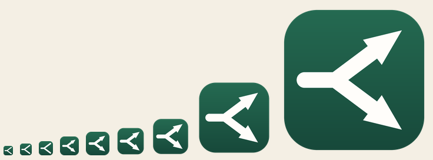

# The Printo mark

One path in, two paths out: a document arrives and is routed. A page with a folded corner would
have said "document" and said nothing at all about the part that is ours.



| File | Used by |
|---|---|
| `printo.ico` | the three Windows executables, and the MSI's Add/Remove Programs entry |
| `printo.svg` | the admin console's favicon, through the generated `apps/web/src/brand.ts` |
| `printo-256.png`, `printo-32.png` | documentation, and anywhere a bitmap is wanted |
| `printo-sizes.png` | the proof sheet above — look at it before committing a change |

## Changing it

Edit the geometry in `tools/branding/generate_icons.py` and re-run it from the repository root:

```bash
python tools/branding/generate_icons.py      # needs Pillow
```

That rewrites everything here **and** `apps/web/src/brand.ts`. All of it is committed, so a
normal build needs neither Python nor Pillow — the script exists so the mark can be changed by
editing numbers rather than by opening a binary in an icon editor.

## Two things worth knowing before changing it

**The palette is not ours to pick.** `#256B52`/`#164739` and `#FFFDFA` come from the admin
console's own `:root` block in `apps/web/src/app.ts` — `--accent` and `--paper-strong`. A
different green on the Windows client would make one product look like two.

**Every size is drawn, not scaled.** An icon is looked at mostly at 16 pixels, and a 256-pixel
drawing shrunk to 16 turns into grey soup. The subject is the same at every size; the detail is
not. The arrowheads only appear from 32 pixels up, where there is room for them to be arrowheads
rather than three dark pixels, and below 32 the glyph is drawn larger and heavier to compensate
for having fewer pixels to be legible in. The file carries 16, 20, 24, 32, 40, 48, 64, 128 and
256 — 20 and 40 are the ones usually left out, and they are the notification area at 125% and
the Start Menu at 150%, which is an ordinary laptop.

`BrandingTests` checks the parts a machine can check: that the file has a drawing for each of
those sizes, that each executable declares the icon, that the installer puts it in Add/Remove
Programs, and that the console's generated module is still the same drawing as the client's.
Whether it is any *good* is what the proof sheet is for.
